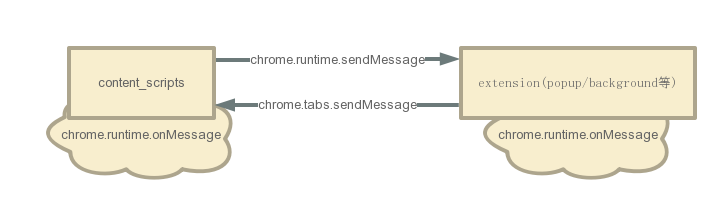
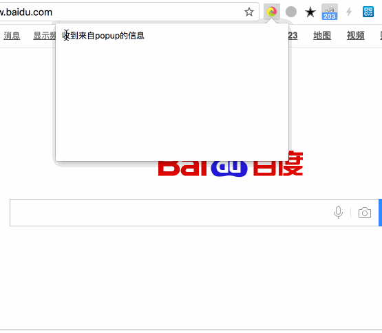
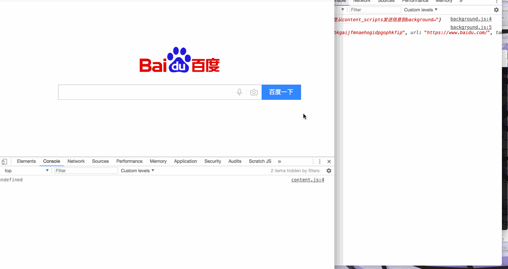
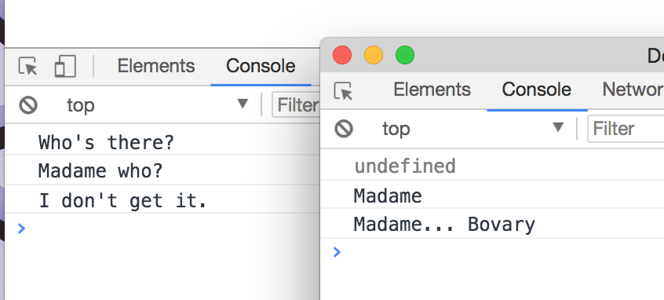

# 消息传递

[DOC](https://developer.chrome.com/extensions/messaging)

文档较复杂，介绍了:

* [简单一次性请求](#t1)
* [长连接](#t2)
* 跨扩展程序消息传递
* 网页发送消息
* 原生消息通信

<h2 id="t1">简单一次性请求</h2>

> extension 包括但不限于 **popup page**、**background** 等

### [DEMO](./simple_one_time_requests)

### 使用API

* chrome.tabs
* chrome.runtime.sendMessage
* chrome.runtime.onMessage

<h2 id="t2">长连接</h2>

### [DEMO](./long_lived_connections)

